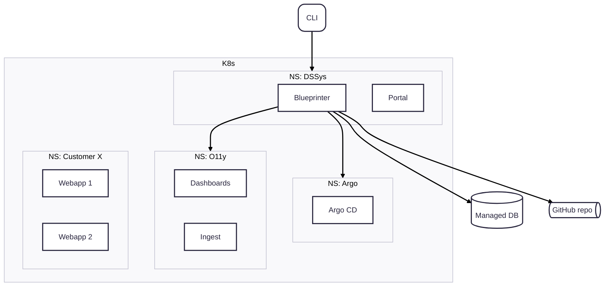

# Blueprinter

```mermaid
---
config:
  theme: redux
---
flowchart TD
 subgraph dssys["NS: DSSys"]
        blueprinter["Blueprinter"]
        portal["Portal"]
  end
  subgraph argo["NS: Argo"]
        argocd["Argo CD"]
  end
  subgraph o11y["NS: O11y"]
        dashboard["Dashboards"]
        ingest["Ingest"]
  end
 subgraph cB["NS: Customer X"]
        cBw1["Webapp 1"]
        cBw2["Webapp 2"]
  end
 subgraph k8s["K8s"]
        argo
        dssys
        o11y
        cB
  end
    db["Managed DB"]
    db@{ shape: cyl}

    cli["CLI"]
    cli@{ shape: rounded}

    repo["GitHub repo"]
    repo@{ shape: h-cyl}

    cli --> dssys

    blueprinter --> argo & repo & o11y & db

```