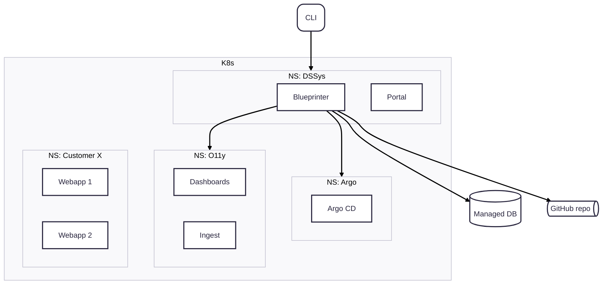

# Blueprinter

`Blueprinter` is our central service responsible for setting up the structures for new customers and services.
It communicates with all relevant services to configure them. It is best used through the `ds` CLI tool but can also directly be called via an API.

## Functionality

`Blueprinter` communicates to the following services:

**GitHub**
- Set up and configure new repositories
- Create default workflows based on the tech stack used
- Set up teams and permissions

**Kubernetes**
- Add namespaces for new customers
- Scaffold k8s/kustomize manifests
  - Adds them to the GitHub repository

**ArgoCD**
- Register new services

**Database**
- Set up a new database with PostgresSQL and/or MongoDB
- Create users and secrets

**Observability**
- Set up a new Grafana dashboard
  - Adds the definition to the GitHub repository
- Sets up new databases and ingest pipelines via Alloy

**Developer Portal**
- Creates new service definitions for `Backstage`
  - Adds them to the GitHub repository

## Interacting with Blueprinter
The default and preferred way of interacting with `Blueprinter` is via the `ds` CLI.
We also offer the ability to use templating via the `Backstage` portal.

If you need to create custom integration you can call `Blueprinter` via its http API.