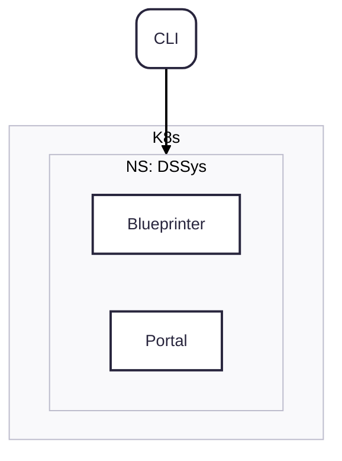

# Command Line Client

`ds` is our primary way of interacting with customers and services on the command line.
It is used to bootstrap new services and manage them. 
When creating a new service or customer `ds` communicates with `Blueprinter`, which then in turn communicates with all 3rd party systems.
To show data and statistics about services `ds` communicates directly with the portal.

Read the [user-guide](/docs/category/user-guide) to learn how to use `ds`.

## Authentication

In order to authenticate with `Blueprinter` OAuth is used. Our central DS OAuth service is called to authenticate the user.
The token is then passed to the respective services (e.g. `Blueprinter`) and validated.
