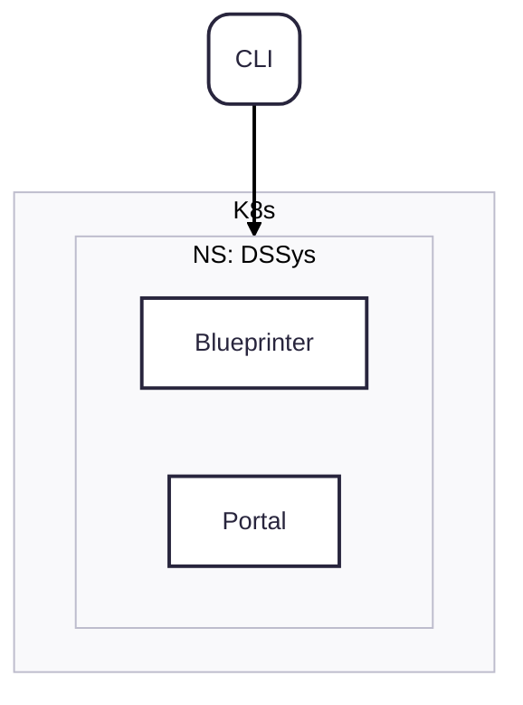

# Command Line Client

```mermaid
---
config:
  theme: redux
---
flowchart TD
 subgraph dssys["NS: DSSys"]
        blueprinter["Blueprinter"]
        portal["Portal"]
  end

 subgraph k8s["K8s"]
        dssys
  end

    cli["CLI"]
    cli@{ shape: rounded}

    cli --> dssys

```