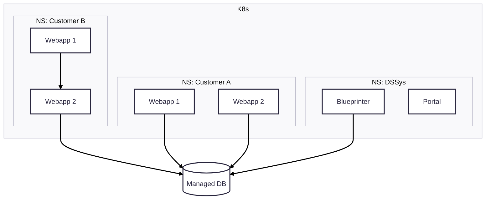

# Databases

```mermaid
---
config:
  theme: redux
---
flowchart TD
 subgraph dssys["NS: DSSys"]
        blueprinter["Blueprinter"]
        portal["Portal"]
  end
 subgraph cB["NS: Customer B"]
        cBw1["Webapp 1"]
        cBw2["Webapp 2"]
  end
 subgraph cA["NS: Customer A"]
        cAw1["Webapp 1"]
        cAw2["Webapp 2"]
  end
 subgraph k8s["K8s"]
        dssys
        cB
        cA
  end
    db["Managed DB"]
    db@{ shape: cyl}

    cBw2 --> db
    cAw1 --> db
    cAw2 --> db
    cBw1 --> cBw2

    blueprinter --> db

```
