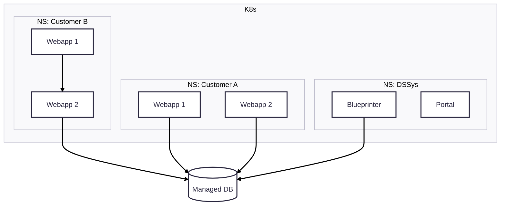

# Databases

We provide managed databases that can be used from any service.
- **PostgresSQL** for structured SQL data
- **MongoDB** for unstructured document data

The databases are configured to be redundant and failsafe. They are also kept on new versions automatically.

## Usage

In order to use a Postgres/Mongo database with your service we need to create a new database within it.
This is usually done via `ds`. You will receive all required secrets and connection data.