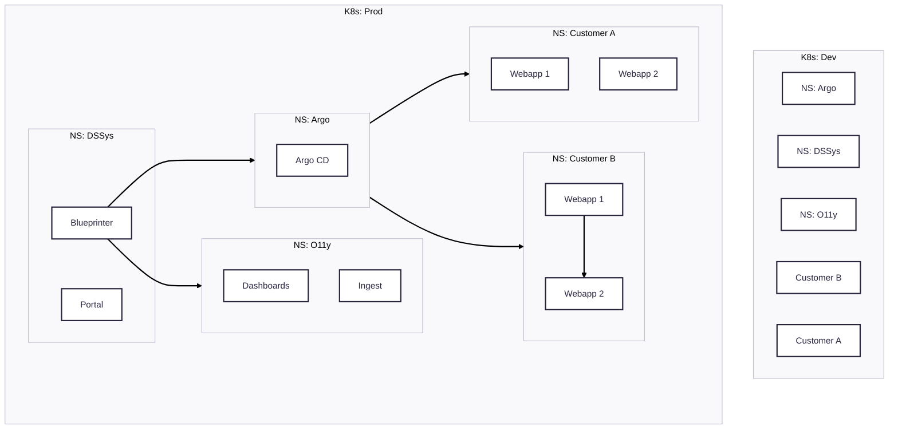

# Kubernetes

```mermaid
---
config:
  theme: redux
---
flowchart TD
 subgraph dssys["NS: DSSys"]
        blueprinter["Blueprinter"]
        portal["Portal"]
  end
  subgraph argo["NS: Argo"]
        argocd["Argo CD"]
  end
  subgraph o11y["NS: O11y"]
        dashboard["Dashboards"]
        ingest["Ingest"]
  end
 subgraph cB["NS: Customer B"]
        cBw1["Webapp 1"]
        cBw2["Webapp 2"]
  end
 subgraph cA["NS: Customer A"]
        cAw1["Webapp 1"]
        cAw2["Webapp 2"]
  end
   subgraph k8sdev["K8s: Dev"]
        argodev["NS: Argo"]
        dssysdev["NS: DSSys"]
        o11ydev["NS: O11y"]
        cBdev["Customer B"]
        cAdev["Customer A"]
  end
 subgraph k8sprod["K8s: Prod"]
        argo
        dssys
        o11y
        cB
        cA
 end
    cBw1 --> cBw2
    argo --> cA & cB

    blueprinter --> argo & o11y

```