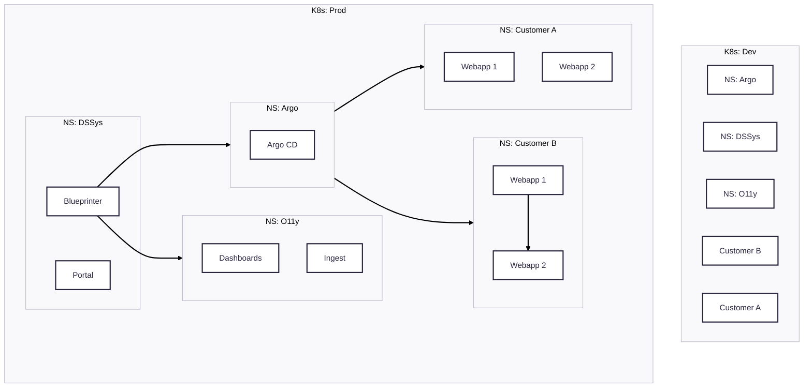

# Kubernetes

`dsenv` is built around Kubernetes as our compute platform.
We run two K8s clusters, one for development and one for production.
Each cluster is further separated into namespaces based on customers internal usage.
With that we make sure that we have clean multi-tenant capabilities and never leak development data or workloads into production.

## Services and definitions

We use [kustomize](https://kustomize.io/) to define flexible application configuration.
When you bootstrap a new service via the `ds` CLI a basic structure is created for you.
This includes a base manifest as well as overlays for development and production.
`ds` provides sensible defaults for most use-cases but you can further adapt the manifests for your specific needs.

Where needed, we use [Helm](https://helm.sh/) for packaging and dependency management.
However, we try to not rely on Helm for customizations and templating. Wherever possible we use kustomize as the outcomes are easier to predict.

## Workloads

We aim to only run compute workloads in k8s. All persistent data is usually stored outside of the clusters.
We provide [managed databases](/docs/architecture/databases) as well as S3 compatible storage if your application needs it.