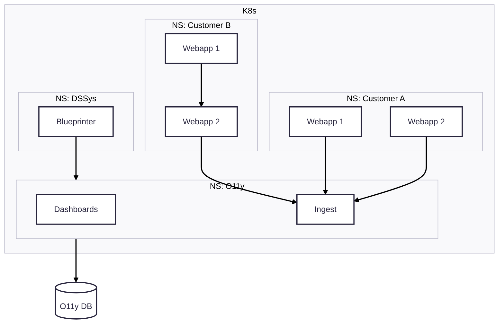

# Observability

Our observability stack is built around [Grafana](https://grafana.com/).
Ingesting data is done via [Alloy](https://grafana.com/docs/alloy/latest/) to respective databases.

We provide storage and analysis for:
- Unstructured log data
- Metrics and time-series
- Telemetry and traces

## Usage

Every services gets a pre-configured ingest pipeline for all support types of data.
We create a dashboard per service that includes all vital metrics.

Additionally we setup alerts for common scenarios.
Every team needs to extend their dashboards and alerts to their actual use-cases.
Important features should have their own observability.