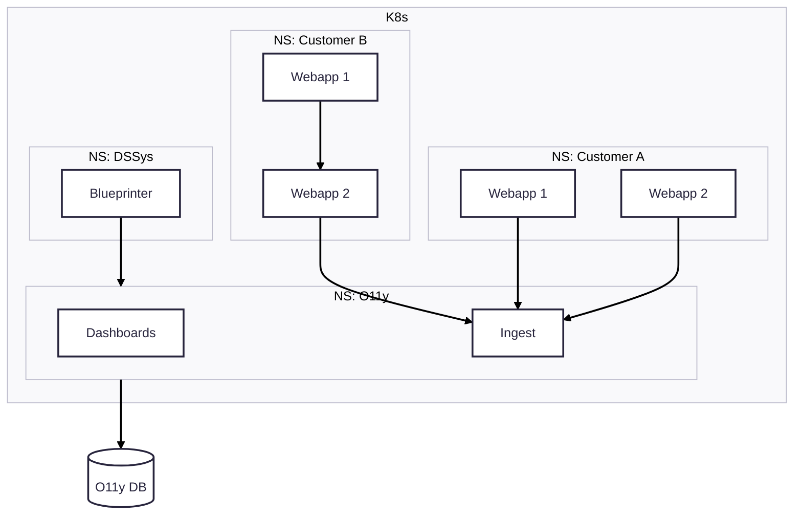

# Observability

```mermaid
---
config:
  theme: redux
---
flowchart TD
 subgraph dssys["NS: DSSys"]
        blueprinter["Blueprinter"]
  end
  subgraph o11y["NS: O11y"]
        dashboard["Dashboards"]
        ingest["Ingest"]
  end
 subgraph cB["NS: Customer B"]
        cBw1["Webapp 1"]
        cBw2["Webapp 2"]
  end
 subgraph cA["NS: Customer A"]
        cAw1["Webapp 1"]
        cAw2["Webapp 2"]
  end
 subgraph k8s["K8s"]
        dssys
        o11y
        cB
        cA
  end
    o11ydb["O11y DB"]
    o11ydb@{ shape: cyl}

    cBw2 --> ingest
    cAw1 --> ingest
    cAw2 --> ingest
    cBw1 --> cBw2
    
    o11y --> o11ydb

    blueprinter --> o11y

```