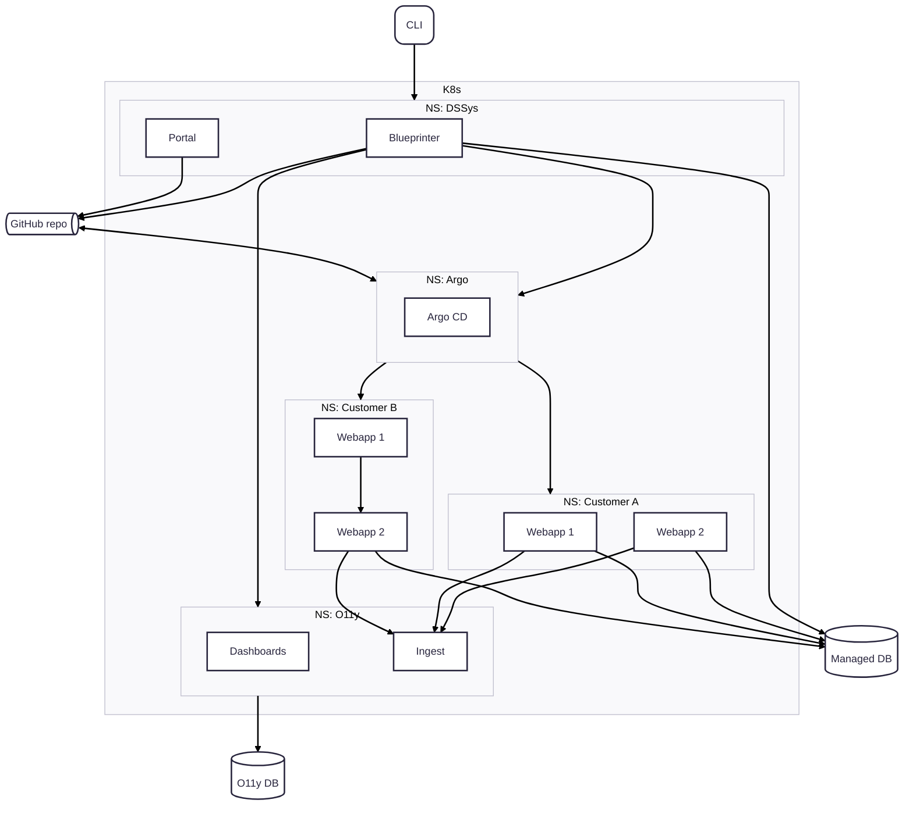

# Overview

`dsenv` is the overall system designed to self-host and run your applications.
It consists of several connected services as well as a cli tool called `ds`.

`dsenv` is built on [kubernetes](/docs/architecture/k8s) and uses namespaces to provide separation and isolation between customers.
There are three additional namespaces configured that hold services for [observability](/docs/architecture/o11y), [CI/CD via ArgoCD](/docs/architecture/cicd) and internal services.

Users interact primarily via our dedicated CLI `ds` with their services as well as our internal ones.
Outside of k8s we are running [managed database services](/docs/architecture/databases), currently for PostgreSQL and MongoDB, as well as databases for observability.

The internal services are the [developer portal](/docs/architecture/portal) and a service called [Blueprinter](/docs/architecture/blueprinter). The developer portal integrates with [GitHub](/docs/architecture/cicd) which is also our source of truth for all configurations.

