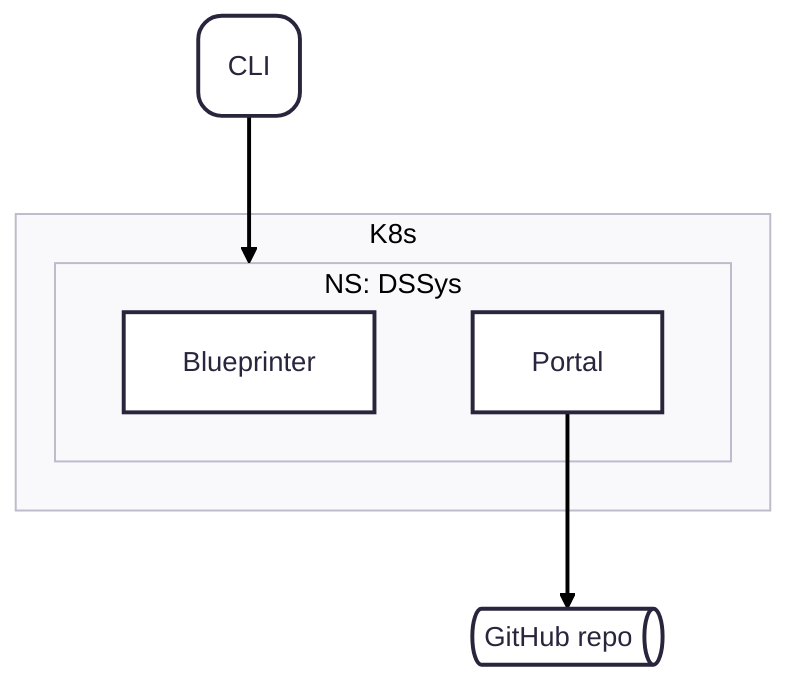

# Developer Portal

We use [Backstage](https://backstage.io) as our developer portal.
Here you can view all services and customers. 
Services integrate with different parts of our system, like k8s and alerts from Grafana.

This way the portal functions as a central UI for all teams. 

## Backstage manifests

Each service needs to have its own Backstage manifest. These are persisted in the GitHub repo of the service.
Backstage automatically syncs any changes back from GitHub.

An initial manifest is created when you bootstrap your service through `ds`.